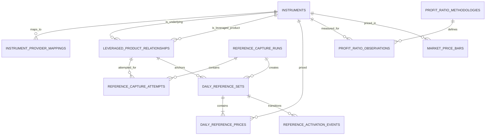

# TraFriend Data Model

## 1. Purpose and status

This document defines the logical persistence model for TraFriend. PostgreSQL is planned but is not required for the documentation phase. Names and constraints are design targets to be converted into reviewed migrations when persistence implementation starts.

The model prioritizes:

- Stable instrument identity independent of ticker text or provider.
- Effective-dated leveraged ETF relationships.
- Immutable and reproducible Daily Reference Price versions.
- Explicit provider and methodology provenance.
- Timezone-safe market data.
- Room for additional analytics modules without a universal catch-all table.

## 2. Global conventions

- Primary keys: UUIDs generated by the application or database.
- Time instants: PostgreSQL `timestamptz`, normalized to UTC at application boundaries.
- Market trading days: PostgreSQL `date`, derived using the relevant exchange calendar.
- Monetary values: `numeric(20, 8)` as an initial proposal; confirm against provider scales before migration.
- Leverage factors: `numeric(8, 4)`, signed and non-zero.
- Ratios/returns: `numeric(20, 12)` in fractional units, with Profit Ratio constrained to `[0, 1]`.
- Currency: ISO 4217 three-character code.
- Exchange: ISO 10383 MIC where available.
- Enum-like values: database check constraints or PostgreSQL enums only when migration cost is justified.
- Metadata: bounded `jsonb` for source provenance only, not as a substitute for modeled fields.
- Mutable tables include `created_at` and `updated_at`; immutable observations include `created_at` and never update their measured fields.

The authoritative API serializes numeric values as decimal strings.

## 3. Entity overview

## 4. Instrument catalog

### 4.1 `instruments`

Canonical security identity used throughout TraFriend.

| Column | Type | Rules / meaning |
|---|---|---|
| `id` | uuid | Primary key |
| `symbol` | text | Current canonical display symbol; normalized uppercase |
| `name` | text | Display name |
| `instrument_type` | text | `stock`, `etf`, or `leveraged_etf` initially |
| `exchange_mic` | text | Listing MIC |
| `currency` | char(3) | Quote currency |
| `status` | text | `active`, `halted`, `delisted`, `unknown` |
| `price_scale` | smallint nullable | Preferred display decimal places if known |
| `valid_from` | date nullable | Known listing/effective start |
| `valid_to` | date nullable | Known end/delisting date |
| `created_at` | timestamptz | Audit timestamp |
| `updated_at` | timestamptz | Audit timestamp |

Suggested indexes and constraints:

- Unique current listing key on normalized `(symbol, exchange_mic)` where `valid_to IS NULL`.
- Trigram or full-text indexes on symbol/name only when search volume justifies them.
- Check `valid_to IS NULL OR valid_from IS NULL OR valid_to >= valid_from`.

A ticker is not used as a foreign key because symbols can change or be reused.

### 4.2 `instrument_provider_mappings`

Maps a canonical instrument to each provider's security identifier.

| Column | Type | Rules / meaning |
|---|---|---|
| `id` | uuid | Primary key |
| `instrument_id` | uuid | FK to `instruments` |
| `provider_code` | text | Stable internal adapter name, such as `mock` or `futu` |
| `provider_instrument_key` | text | Provider's opaque identifier |
| `provider_market` | text nullable | Provider market namespace when needed |
| `valid_from` | timestamptz nullable | Mapping effective instant |
| `valid_to` | timestamptz nullable | Mapping end instant |
| `source_metadata` | jsonb | Bounded, non-secret provenance |
| `created_at` | timestamptz | Audit timestamp |

Constraints:

- Unique active `(provider_code, provider_instrument_key, provider_market)` mapping.
- Unique active `(instrument_id, provider_code)` mapping unless a documented provider requires multiple identifiers.
- Provider keys and metadata must never contain credentials.

### 4.3 `leveraged_product_relationships`

Curated/evidenced mapping from one leveraged ETF to its underlying and daily target factor.

| Column | Type | Rules / meaning |
|---|---|---|
| `id` | uuid | Primary key |
| `underlying_instrument_id` | uuid | FK to `instruments` |
| `leveraged_instrument_id` | uuid | FK to `instruments` |
| `leverage_factor` | numeric(8,4) | Signed and non-zero |
| `objective_period` | text | `daily` for the MVP |
| `effective_from` | date | Inclusive relationship start |
| `effective_to` | date nullable | Inclusive relationship end |
| `metadata_source` | text | Curated/source identifier |
| `methodology_version` | text | Version of relationship interpretation |
| `created_at` | timestamptz | Audit timestamp |
| `updated_at` | timestamptz | Audit timestamp |

Constraints:

- Underlying and leveraged instrument IDs differ.
- Referenced leveraged instrument has type `leveraged_etf` (enforced in application service or trigger because a simple check cannot inspect another table).
- `effective_to IS NULL OR effective_to >= effective_from`.
- Effective ranges for the same leveraged instrument do not overlap. A PostgreSQL exclusion constraint is preferred.
- A unique active relationship covers `(underlying_instrument_id, leveraged_instrument_id, objective_period)`.

The relationship is effective-dated because funds can change objectives, factors, or underlyings. Never edit historical leverage facts in place.

## 5. Daily Reference Price model

### 5.1 `reference_capture_runs`

One scheduled or manually authorized attempt window for a session/trading date/provider.

| Column | Type | Rules / meaning |
|---|---|---|
| `id` | uuid | Primary key |
| `trading_date` | date | Derived exchange trading date |
| `session_code` | text | `us_overnight`; exchange-local session identity |
| `reference_type` | text | `OVERNIGHT_OPEN` or `OVERNIGHT_SNAPSHOT`; never mixed |
| `provider_code` | text | Adapter used by the run |
| `trigger_kind` | text | `scheduled`, `retry`, or `manual_correction` |
| `idempotency_key` | text | Unique scheduler/application key |
| `scheduled_for` | timestamptz | Intended 20:00/open search or 20:05 snapshot instant |
| `started_at` | timestamptz | Run start |
| `completed_at` | timestamptz nullable | Run completion |
| `status` | text | `pending`, `running`, `succeeded`, `partial`, `failed` |
| `failure_summary` | text nullable | Sanitized operational summary |
| `created_at` | timestamptz | Audit timestamp |

Constraints and indexes:

- Unique `idempotency_key`.
- Index `(trading_date, session_code, provider_code)`.
- Status/timestamp combinations are validated by application and database checks where practical.

A run can be `partial` even when some individual reference pairs are valid and active.

### 5.2 `reference_capture_attempts`

Operational outcome for each relationship considered by a capture run. This stores failures without creating an invalid published reference set.

| Column | Type | Rules / meaning |
|---|---|---|
| `id` | uuid | Primary key |
| `capture_run_id` | uuid | FK to `reference_capture_runs` |
| `relationship_id` | uuid | FK to `leveraged_product_relationships` |
| `attempt_number` | integer | Positive retry sequence |
| `status` | text | `pending`, `succeeded`, `missing_quote`, `stale_quote`, `invalid_quote`, `provider_error` |
| `reference_type` | text | Method attempted; must match its run |
| `source_feed` | text nullable | Safe provider feed label, for example `overnight` or `boats` |
| `underlying_quoted_at` | timestamptz nullable | Diagnostic timestamp |
| `leveraged_quoted_at` | timestamptz nullable | Diagnostic timestamp |
| `error_code` | text nullable | Stable internal class, no secrets |
| `error_detail` | text nullable | Sanitized bounded detail |
| `started_at` | timestamptz | Attempt start |
| `completed_at` | timestamptz nullable | Attempt end |

Unique `(capture_run_id, relationship_id, attempt_number)`.

### 5.3 `daily_reference_sets`

Immutable version metadata for a complete underlying/leveraged ETF pair.

| Column | Type | Rules / meaning |
|---|---|---|
| `id` | uuid | Primary key; exposed as opaque reference version ID |
| `relationship_id` | uuid | FK to `leveraged_product_relationships` |
| `capture_run_id` | uuid | FK to `reference_capture_runs` |
| `trading_date` | date | Intended exchange trading date |
| `session_code` | text | Capture session |
| `reference_type` | text | `OVERNIGHT_OPEN` or `OVERNIGHT_SNAPSHOT` |
| `version` | integer | Starts at 1 for relationship/date/session |
| `status` | text | `candidate`, `active`, `superseded`, `rejected` |
| `provider_code` | text | Quote source |
| `captured_at` | timestamptz | Pair assembled/persisted |
| `validation_policy_version` | text | Reproduces freshness/skew rules |
| `correction_reason` | text nullable | Required for replacement versions |
| `created_at` | timestamptz | Audit timestamp |

Constraints:

- Unique `(relationship_id, trading_date, session_code, version)`.
- Partial unique index allowing at most one `active` set per `(relationship_id, trading_date, session_code)`.
- `version > 0`.
- Once a set is active/superseded, price and relationship fields are immutable.
- Active set date falls inside the relationship effective range.

Ordinary retries create a set only for a previously failed pair. An operator correction creates a higher immutable version and records why it superseded the prior version.

### 5.4 `daily_reference_prices`

Exactly two normalized price members of a complete reference set.

| Column | Type | Rules / meaning |
|---|---|---|
| `id` | uuid | Primary key |
| `reference_set_id` | uuid | FK to `daily_reference_sets` |
| `role` | text | `underlying` or `leveraged_product` |
| `instrument_id` | uuid | FK to `instruments` |
| `price` | numeric(20,8) | Greater than zero |
| `currency` | char(3) | Must agree with relationship/instrument policy |
| `market_timestamp` | timestamptz | Actual quote event or one-minute bar start |
| `observed_at` | timestamptz | Backend receipt/observation instant |
| `reference_type` | text | Must match the parent set |
| `source` | text | Safe provider label |
| `source_feed` | text | Safe feed/venue label |
| `price_basis` | text | `BAR_OPEN` or `QUOTE_MIDPOINT` for the initial methods |
| `quality` | text | `REALTIME`, `DELAYED`, `STALE`, or `UNAVAILABLE` |
| `capture_status` | text | `AVAILABLE`, `REJECTED`, or `MISSING` |
| `provider_record_id` | text nullable | Non-secret source record identifier |
| `source_metadata` | jsonb | Bounded non-secret provenance |
| `created_at` | timestamptz | Audit timestamp |

Constraints:

- Unique `(reference_set_id, role)`.
- Unique `(reference_set_id, instrument_id)`.
- `price > 0`.
- Role/instrument identity must match the referenced relationship.
- A set can transition to `active` only when it has exactly one valid row for each role. Enforce this in one transaction with application validation and, if feasible, a deferred database constraint/trigger.
- Market timestamps pass the versioned capture-window and maximum-skew policy.
- `OVERNIGHT_OPEN` members use the first valid one-minute bar at or after 20:00 ET inside the search window.
- `OVERNIGHT_SNAPSHOT` members belong to the same batch attempt near 20:05 ET and meet pair synchronization tolerance.
- Only `AVAILABLE` rows with `REALTIME` or an explicitly approved delayed policy can be candidates. `STALE` and `UNAVAILABLE` rows are attempt/audit data and cannot activate a pair.
- A complete set has one reference type, provider, source feed, trading date, and policy version. No fallback can import a previous session's value.

### 5.5 `reference_activation_events`

Append-only audit log for activation and supersession.

| Column | Type | Rules / meaning |
|---|---|---|
| `id` | uuid | Primary key |
| `reference_set_id` | uuid | FK to `daily_reference_sets` |
| `event_type` | text | `activated`, `superseded`, `rejected` |
| `reason` | text | Scheduled publication or correction reason |
| `actor_type` | text | `worker`, `operator`, `system` |
| `actor_id` | text nullable | Internal principal/job identifier, if applicable |
| `occurred_at` | timestamptz | Event instant |

This makes corrections auditable without mutating history away.

## 6. Profit Ratio and comparison price data

### 6.1 `profit_ratio_methodologies`

Versioned definition of what a Profit Ratio observation means.

| Column | Type | Rules / meaning |
|---|---|---|
| `id` | uuid | Primary key |
| `methodology_key` | text | Stable public-safe key |
| `version` | text | Source/method version |
| `display_name` | text | User-facing short label |
| `definition` | text | Reviewed semantic definition |
| `provider_code` | text | Source/producer |
| `sampling_description` | text | Cadence and timing |
| `corporate_action_policy` | text | Treatment or documented limitation |
| `valid_from` | timestamptz | Method applicability start |
| `valid_to` | timestamptz nullable | Method applicability end |
| `created_at` | timestamptz | Audit timestamp |

Unique `(methodology_key, version)`. Changes that alter meaning create a new row/version; they do not rewrite observations.

### 6.2 `profit_ratio_observations`

Immutable normalized point observations.

| Column | Type | Rules / meaning |
|---|---|---|
| `id` | uuid | Primary key |
| `instrument_id` | uuid | FK to `instruments` |
| `methodology_id` | uuid | FK to `profit_ratio_methodologies` |
| `ratio` | numeric(20,12) | Inclusive range `[0, 1]` |
| `observed_at` | timestamptz | Effective measurement instant |
| `trading_date` | date | Exchange trading date |
| `quality` | text | `preliminary`, `final`, `corrected` |
| `provider_record_id` | text nullable | Source record identity |
| `ingested_at` | timestamptz | Backend receipt instant |
| `source_metadata` | jsonb | Bounded provenance, no credentials |
| `created_at` | timestamptz | Audit timestamp |

Constraints and indexes:

- Check `ratio >= 0 AND ratio <= 1`.
- Unique source identity when a provider record ID exists.
- Otherwise unique `(instrument_id, methodology_id, observed_at, quality)` under the approved correction policy.
- Index `(instrument_id, methodology_id, observed_at DESC)` for latest/history reads.
- Index `(instrument_id, trading_date)` for daily range queries.

Corrections should append a corrected observation or follow a documented revision chain; they should not silently alter the originally ingested value.

### 6.3 `market_price_bars`

Normalized price bars used for Profit Ratio comparison. Do not overload Daily Reference Prices for chart history because the two datasets have different timing and semantics.

| Column | Type | Rules / meaning |
|---|---|---|
| `id` | uuid | Primary key |
| `instrument_id` | uuid | FK to `instruments` |
| `interval` | text | Initially `1d` |
| `bar_start` | timestamptz | Inclusive interval start |
| `bar_end` | timestamptz | Exclusive interval end |
| `trading_date` | date | Exchange trading date |
| `open` | numeric(20,8) nullable | Positive when present |
| `high` | numeric(20,8) nullable | Positive when present |
| `low` | numeric(20,8) nullable | Positive when present |
| `close` | numeric(20,8) | Positive |
| `volume` | numeric(28,8) nullable | Non-negative when present |
| `adjustment` | text | `unadjusted`, `split_adjusted`, or approved policy |
| `provider_code` | text | Data source |
| `provider_record_id` | text nullable | Source identity |
| `ingested_at` | timestamptz | Receipt time |
| `created_at` | timestamptz | Audit timestamp |

Constraints validate positive prices, `high >= open/close/low` and `low <= open/close/high` where fields are present, bar order, and uniqueness by instrument/interval/start/adjustment/source policy.

### 6.4 Future `profit_ratio_bars`

Do not create this table until genuine multiple observations per interval exist and OHLC semantics are approved. A future table may store `open`, `high`, `low`, `close`, observation count, completeness, interval boundaries, and methodology ID. Every value remains bounded to `[0, 1]`. Bars derived from a single point must not be presented as true OHLC.

## 7. Read models and query behavior

Start with normalized tables and repository queries. Add materialized views only after profiling shows a need.

Candidate read models:

- Active relationship plus today's active reference set.
- Latest Profit Ratio per instrument/methodology.
- Daily Profit Ratio and closing-price comparison by trading date.

Rules:

- “Current” is computed using `TradingCalendarPort`, not `CURRENT_DATE` alone.
- Reference queries always select `status = 'active'` for the intended relationship/date/session.
- Historical Profit Ratio responses use one methodology version unless they return explicit break metadata.
- Missing observations remain missing. Database queries must not silently interpolate or forward-fill.

## 8. Transactions and concurrency

### 8.1 Reference capture

For each valid pair, a transaction should:

1. Acquire a relationship/date/session-scoped lock or rely on a safe uniqueness retry.
2. Insert the reference-set version and both price rows.
3. Validate membership, completeness, freshness, timestamp skew, and version.
4. Activate the new set only if no active set exists, or follow the explicit correction workflow.
5. Append activation events.
6. Commit atomically.

No reader should observe an active set with one price.

### 8.2 Ingestion idempotency

- Capture runs use unique idempotency keys.
- Provider records use provider IDs when stable; otherwise use documented natural keys/hashes.
- Retries return an existing successful outcome or create only the next allowed immutable version.
- API calculation requests do not write calculation rows in the MVP.

## 9. Retention, audit, and data rights

- Keep Daily Reference Price versions and activation events long enough to reproduce any displayed result; default proposal is indefinite while the product is young.
- Keep capture failures for an operationally useful period, then aggregate or delete under a documented retention policy.
- Retain raw provider payloads only if licensing, privacy, and operational need permit it. Prefer bounded normalized provenance over raw payload storage.
- Provider licensing may limit storage duration, derived data, or redistribution. Confirm rights before finalizing production retention.
- Database backups, restoration tests, and migration rollback/forward plans are required before production.

## 10. Security and access

- Public API roles receive read-only access through repositories, not direct database credentials.
- Worker roles can insert observations and reference candidates; activation/correction privileges are separated where practical.
- Migration roles are not used by runtime services.
- Provider credentials are never stored in these tables.
- Operational error fields are sanitized and length-bounded.
- Audit data avoids personal data; the MVP has no user/account tables.

## 11. Migration sequencing

Recommended migration order when PostgreSQL implementation starts:

1. Instrument catalog and provider mappings.
2. Effective-dated leveraged product relationships.
3. Capture runs, attempts, immutable reference sets/prices, and activation audit.
4. Profit Ratio methodologies and observations.
5. Market price bars.
6. Performance indexes/materialized views only after query measurement.

Each migration requires repository integration tests for constraints and rollback/forward behavior. Seed data should contain deterministic development fixtures only, not licensed production payloads or secrets.

## 12. Data-model decisions still required

- Confirm numeric precision/scale from chosen providers and maximum supported prices.
- Decide whether corrected provider observations append revisions or supersede through a separate revision link.
- Choose exact active-reference enforcement (deferred trigger versus transaction plus constraints).
- Confirm instrument-symbol history requirements and corporate-action source.
- Approve Profit Ratio methodology and whether provider licensing permits historical storage.
- Set retention periods for attempts, raw metadata, price bars, and analytics observations.
