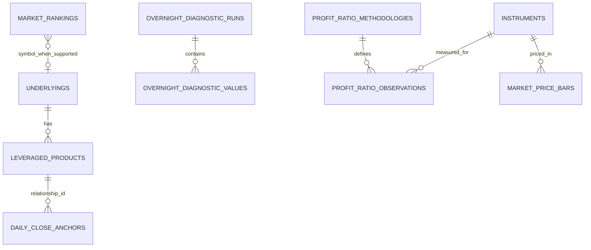

# TraFriend Data Model

## 1. Purpose and status

This document defines TraFriend's logical persistence model. PostgreSQL persistence is implemented for immutable Daily Close Anchors, the curated leveraged-product universe, and separately sourced market rankings. Profit Ratio and overnight-diagnostic tables remain design targets.

The model prioritizes:

- Stable instrument identity independent of ticker text or provider.
- Effective-dated leveraged ETF relationships.
- Immutable and reproducible Daily Close Anchor versions.
- Explicit provider and methodology provenance.
- Timezone-safe market data.
- Room for additional analytics modules without a universal catch-all table.

## 2. Global conventions

- Primary keys: UUIDs generated by the application or database.
- Time instants: PostgreSQL `timestamptz`, normalized to UTC at application boundaries.
- Market trading days: PostgreSQL `date`, derived using the relevant exchange calendar.
- Monetary values: `numeric(20, 8)` as an initial proposal; confirm against provider scales before migration.
- Leverage factors: `numeric(8, 4)`, signed and non-zero.
- Ratios/returns: `numeric(20, 12)` in fractional units, with Profit Ratio constrained to `[0, 1]`.
- Currency: ISO 4217 three-character code.
- Exchange: ISO 10383 MIC where available.
- Enum-like values: database check constraints or PostgreSQL enums only when migration cost is justified.
- Metadata: bounded `jsonb` for source provenance only, not as a substitute for modeled fields.
- Mutable tables include `created_at` and `updated_at`; immutable observations include `created_at` and never update their measured fields.

The authoritative API serializes numeric values as decimal strings.

## 3. Entity overview

## 4. Leveraged-product universe

Migration `20260906_0002` creates provider-independent `underlyings` and
`leveraged_products` tables. Migrations `20260907_0004` and `20260907_0005` expand
the initial and September Top-100 coverage; migration `20260907_0007` expands the
2026-09-07 catalog snapshot to 238 underlyings and 493 active daily leveraged
products. The underlyings are 236 stocks plus QQQ and SOXX. Products were discovered
against the active Alpaca asset catalog and each relationship was checked against
the official Corgi, Defiance, Direxion, GraniteShares, KraneShares, Leverage Shares,
ProShares, T-REX, or Tradr issuer catalog. This remains a dated, reproducible coverage
snapshot rather than a claim that an unmaintained database will stay complete as new
funds launch. Option-income products, different-index/basket products,
commodity/crypto products, and non-daily-reset products are excluded. Relationships
are never inferred from ticker names.

### 4.1 `underlyings`

Canonical supported underlying identity used throughout the calculator.

| Column | Type | Rules / meaning |
|---|---|---|
| `id` | text | Stable canonical identifier |
| `symbol` | text | Current canonical display symbol; normalized uppercase |
| `display_name` | text | Display name |
| `instrument_type` | text | `stock` or `etf` |
| `exchange_mic` | text | Listing MIC |
| `currency` | char(3) | Quote currency |
| `active` | boolean | Whether the underlying is selectable |
| `profit_ratio_available` | boolean | Independent feature capability |
| `created_at`, `updated_at` | timestamptz | Mutable catalog audit timestamps |

Implemented indexes and constraints:

- Unique normalized `symbol`.
- Uppercase-symbol check.

A ticker is not used as a foreign key because symbols can change or be reused.

### 4.2 `instrument_provider_mappings`

Maps a canonical instrument to each provider's security identifier.

| Column | Type | Rules / meaning |
|---|---|---|
| `id` | uuid | Primary key |
| `instrument_id` | uuid | FK to `instruments` |
| `provider_code` | text | Stable internal adapter name, such as `mock` or `futu` |
| `provider_instrument_key` | text | Provider's opaque identifier |
| `provider_market` | text nullable | Provider market namespace when needed |
| `valid_from` | timestamptz nullable | Mapping effective instant |
| `valid_to` | timestamptz nullable | Mapping end instant |
| `source_metadata` | jsonb | Bounded, non-secret provenance |
| `created_at` | timestamptz | Audit timestamp |

Constraints:

- Unique active `(provider_code, provider_instrument_key, provider_market)` mapping.
- Unique active `(instrument_id, provider_code)` mapping unless a documented provider requires multiple identifiers.
- Provider keys and metadata must never contain credentials.

### 4.3 `leveraged_products`

Curated/evidenced mapping from one leveraged ETF to its underlying and daily target factor.

| Column | Type | Rules / meaning |
|---|---|---|
| `id` | text | Stable canonical leveraged-product identifier |
| `relationship_id` | text | Stable relationship identifier used by anchors |
| `symbol`, `display_name`, `exchange_mic` | text | Product identity and display metadata |
| `underlying_id` | text | FK to `underlyings` |
| `signed_leverage` | numeric(8,4) | Verified non-zero daily factor |
| `issuer` | text | Issuer/manager label |
| `direction` | text | `LONG` or `INVERSE`, constrained to the factor sign |
| `active` | boolean | Current catalog availability |
| `authoritative_source` | text | Issuer or SEC verification URL |
| `verified_at` | timestamptz | Last verification instant |
| `effective_from` | date | Inclusive relationship start |
| `effective_to` | date nullable | Inclusive relationship end |
| `objective_period` | text | `daily` for the MVP |
| `created_at` | timestamptz | Audit timestamp |
| `updated_at` | timestamptz | Audit timestamp |

Constraints:

- `effective_to IS NULL OR effective_to >= effective_from`.
- Unique `symbol` and unique `relationship_id`.
- Direction must match the sign of `signed_leverage`.
- `underlying_id` uses a restrictive foreign key.

The relationship is effective-dated because funds can change objectives, factors, or underlyings. Never edit historical leverage facts in place.

### 4.4 `market_rankings`

Ranking data is independent from both curated relationships and captured prices.

| Column | Type | Rules / meaning |
|---|---|---|
| `ranking_period` | text | For example `2026-09` |
| `period_start`, `period_end` | date | Actual covered interval |
| `period_status` | text | `SEPTEMBER_TO_DATE`, `MONTH_TO_DATE`, or `FINAL` |
| `ranking_type` | text | `DOLLAR_TRADING_VOLUME` |
| `rank` | integer | 1 through 100 |
| `symbol` | text | Ranked underlying symbol |
| `display_name`, `exchange` | text | Provider asset metadata used by Popular |
| `trading_metric` | numeric(30,4) | `SUM(daily VWAP * daily share volume)` |
| `calculated_at` | timestamptz | Dataset calculation instant |
| `source` | text | Licensed source attribution |
| `completeness_status` | text | `COMPLETE` or `INCOMPLETE` |
| `sessions_observed`, `sessions_expected` | integer | Coverage evidence; selected rows require equality |

Unique constraints prevent duplicate ranks or symbols within a period/type. The first-party builder and alternate importer both atomically replace one coherent period/type dataset. The builder ranks the independently fetched active U.S.-equity universe and never derives candidates from the curated product list.

## 5. Daily Close Anchor model

Migration `20260906_0001` implements one denormalized, atomic `daily_close_anchors` table. Migration `20260906_0002` adds the catalog without rewriting this validated immutable anchor architecture. Anchors retain captured symbols and signed leverage for reproducibility; the catalog supplies current searchable metadata. The in-memory repository retains the same idempotency and conflict semantics for deterministic tests.

### 5.1 `daily_close_anchors`

One immutable, complete calculator anchor for a relationship and expected completed exchange session. Missing, partial, stale, or mismatched-date capture outcomes are returned by the application but are not inserted into this calculator-eligible table.

| Column | Type | Rules / meaning |
|---|---|---|
| `id` | uuid | Primary key; exposed as an opaque anchor version ID |
| `relationship_id` | text | Stable curated relationship identifier |
| `underlying_symbol` | text | Uppercase symbol at capture |
| `leveraged_product_symbol` | text | Uppercase leveraged ETF symbol at capture |
| `signed_leverage` | numeric(8,4) | Curated finite, non-zero daily factor |
| `trading_date` | date | Expected latest completed XNYS session |
| `underlying_trading_date` | date | Must equal `trading_date` |
| `leveraged_product_trading_date` | date | Must equal `trading_date` |
| `session_closed_at` | timestamptz | Actual exchange-calendar close instant |
| `version` | integer | Positive immutable sequence for the relationship |
| `status` | text | Always `COMPLETE` in persisted rows |
| `underlying_close` | numeric(20,8) | Exact positive Decimal value |
| `leveraged_product_close` | numeric(20,8) | Exact positive Decimal value |
| `provider` | text | Safe provider label |
| `source_feed` | text | Safe feed label |
| `underlying_market_timestamp` | timestamptz | Provider daily-bar timestamp |
| `leveraged_product_market_timestamp` | timestamptz | Provider daily-bar timestamp |
| `underlying_observed_at` | timestamptz | Backend observation instant |
| `leveraged_product_observed_at` | timestamptz | Backend observation instant |
| `underlying_quality` | text | Accepted `REALTIME` or `DELAYED` quality |
| `leveraged_product_quality` | text | Accepted `REALTIME` or `DELAYED` quality |
| `underlying_currency` | char(3) | `USD` |
| `leveraged_product_currency` | char(3) | `USD` |
| `underlying_message` | text | Bounded sanitized validation reason |
| `leveraged_product_message` | text | Bounded sanitized validation reason |
| `anchor_type` | text | Always `DAILY_CLOSE_ANCHOR` |
| `captured_at` | timestamptz | Pair validation/persistence instant |
| `created_at` | timestamptz | Audit timestamp |

Constraints:

- Unique `(underlying_symbol, leveraged_product_symbol, trading_date)` logical identity.
- Unique `(relationship_id, trading_date)` and `(relationship_id, version)`; `version > 0`.
- Prices are positive, signed leverage is non-zero, both member dates equal `trading_date`, and both currencies are `USD`.
- Rows are append-only. A PostgreSQL trigger rejects `UPDATE` and `DELETE`.
- Identical recapture ignores retry-only observation/capture timestamps and returns the stored row. A material close, leverage, relationship, market-timestamp, provider, feed, quality, currency, or session conflict raises explicitly.
- Corrections are intentionally not implemented yet; they require a reviewed higher-version policy and must never mutate the existing row.
- `session_closed_at <= captured_at`.
- The trading date is resolved by the exchange calendar, never database `CURRENT_DATE`.

### 5.2 Separate overnight diagnostic model

The following earlier design records `OVERNIGHT_OPEN` and `OVERNIGHT_SNAPSHOT` experiments. These entities are **not calculator anchors** and must not be queried by the calculator repository. Their production persistence remains unimplemented.

#### 5.2.1 `reference_capture_runs`

One scheduled or manually authorized attempt window for a session/trading date/provider.

| Column | Type | Rules / meaning |
|---|---|---|
| `id` | uuid | Primary key |
| `trading_date` | date | Derived exchange trading date |
| `session_code` | text | `us_overnight`; exchange-local session identity |
| `reference_type` | text | `OVERNIGHT_OPEN` or `OVERNIGHT_SNAPSHOT`; never mixed |
| `provider_code` | text | Adapter used by the run |
| `trigger_kind` | text | `scheduled`, `retry`, or `manual_correction` |
| `idempotency_key` | text | Unique scheduler/application key |
| `scheduled_for` | timestamptz | Intended 20:00/open search or 20:05 snapshot instant |
| `started_at` | timestamptz | Run start |
| `completed_at` | timestamptz nullable | Run completion |
| `status` | text | `pending`, `running`, `succeeded`, `partial`, `failed` |
| `failure_summary` | text nullable | Sanitized operational summary |
| `created_at` | timestamptz | Audit timestamp |

Constraints and indexes:

- Unique `idempotency_key`.
- Index `(trading_date, session_code, provider_code)`.
- Status/timestamp combinations are validated by application and database checks where practical.

A run can be `partial` even when some individual reference pairs are valid and active.

#### 5.2.2 `reference_capture_attempts`

Operational outcome for each relationship considered by a capture run. This stores failures without creating an invalid published reference set.

| Column | Type | Rules / meaning |
|---|---|---|
| `id` | uuid | Primary key |
| `capture_run_id` | uuid | FK to `reference_capture_runs` |
| `relationship_id` | uuid | FK to `leveraged_product_relationships` |
| `attempt_number` | integer | Positive retry sequence |
| `status` | text | `pending`, `succeeded`, `missing_quote`, `stale_quote`, `invalid_quote`, `provider_error` |
| `reference_type` | text | Method attempted; must match its run |
| `source_feed` | text nullable | Safe provider feed label, for example `overnight` or `boats` |
| `underlying_quoted_at` | timestamptz nullable | Diagnostic timestamp |
| `leveraged_quoted_at` | timestamptz nullable | Diagnostic timestamp |
| `error_code` | text nullable | Stable internal class, no secrets |
| `error_detail` | text nullable | Sanitized bounded detail |
| `started_at` | timestamptz | Attempt start |
| `completed_at` | timestamptz nullable | Attempt end |

Unique `(capture_run_id, relationship_id, attempt_number)`.

#### 5.2.3 `daily_reference_sets`

Immutable version metadata for a complete underlying/leveraged ETF pair.

| Column | Type | Rules / meaning |
|---|---|---|
| `id` | uuid | Primary key; exposed as opaque reference version ID |
| `relationship_id` | uuid | FK to `leveraged_product_relationships` |
| `capture_run_id` | uuid | FK to `reference_capture_runs` |
| `trading_date` | date | Intended exchange trading date |
| `session_code` | text | Capture session |
| `reference_type` | text | `OVERNIGHT_OPEN` or `OVERNIGHT_SNAPSHOT` |
| `version` | integer | Starts at 1 for relationship/date/session |
| `status` | text | `candidate`, `active`, `superseded`, `rejected` |
| `provider_code` | text | Quote source |
| `captured_at` | timestamptz | Pair assembled/persisted |
| `validation_policy_version` | text | Reproduces freshness/skew rules |
| `correction_reason` | text nullable | Required for replacement versions |
| `created_at` | timestamptz | Audit timestamp |

Constraints:

- Unique `(relationship_id, trading_date, session_code, version)`.
- Partial unique index allowing at most one `active` set per `(relationship_id, trading_date, session_code)`.
- `version > 0`.
- Once a set is active/superseded, price and relationship fields are immutable.
- Active set date falls inside the relationship effective range.

Ordinary retries create a set only for a previously failed pair. An operator correction creates a higher immutable version and records why it superseded the prior version.

#### 5.2.4 `daily_reference_prices`

Exactly two normalized price members of a complete reference set.

| Column | Type | Rules / meaning |
|---|---|---|
| `id` | uuid | Primary key |
| `reference_set_id` | uuid | FK to `daily_reference_sets` |
| `role` | text | `underlying` or `leveraged_product` |
| `instrument_id` | uuid | FK to `instruments` |
| `price` | numeric(20,8) | Greater than zero |
| `currency` | char(3) | Must agree with relationship/instrument policy |
| `market_timestamp` | timestamptz | Actual quote event or one-minute bar start |
| `observed_at` | timestamptz | Backend receipt/observation instant |
| `reference_type` | text | Must match the parent set |
| `source` | text | Safe provider label |
| `source_feed` | text | Safe feed/venue label |
| `price_basis` | text | `BAR_OPEN` or `QUOTE_MIDPOINT` for the initial methods |
| `quality` | text | `REALTIME`, `DELAYED`, `STALE`, or `UNAVAILABLE` |
| `capture_status` | text | `AVAILABLE`, `REJECTED`, or `MISSING` |
| `provider_record_id` | text nullable | Non-secret source record identifier |
| `source_metadata` | jsonb | Bounded non-secret provenance |
| `created_at` | timestamptz | Audit timestamp |

Constraints:

- Unique `(reference_set_id, role)`.
- Unique `(reference_set_id, instrument_id)`.
- `price > 0`.
- Role/instrument identity must match the referenced relationship.
- A set can transition to `active` only when it has exactly one valid row for each role. Enforce this in one transaction with application validation and, if feasible, a deferred database constraint/trigger.
- Market timestamps pass the versioned capture-window and maximum-skew policy.
- `OVERNIGHT_OPEN` members use the first valid one-minute bar at or after 20:00 ET inside the search window.
- `OVERNIGHT_SNAPSHOT` members belong to the same batch attempt near 20:05 ET and meet pair synchronization tolerance.
- Only `AVAILABLE` rows with `REALTIME` or an explicitly approved delayed policy can be candidates. `STALE` and `UNAVAILABLE` rows are attempt/audit data and cannot activate a pair.
- A complete set has one reference type, provider, source feed, trading date, and policy version. No fallback can import a previous session's value.

#### 5.2.5 `reference_activation_events`

Append-only audit log for activation and supersession.

| Column | Type | Rules / meaning |
|---|---|---|
| `id` | uuid | Primary key |
| `reference_set_id` | uuid | FK to `daily_reference_sets` |
| `event_type` | text | `activated`, `superseded`, `rejected` |
| `reason` | text | Scheduled publication or correction reason |
| `actor_type` | text | `worker`, `operator`, `system` |
| `actor_id` | text nullable | Internal principal/job identifier, if applicable |
| `occurred_at` | timestamptz | Event instant |

This makes corrections auditable without mutating history away.

## 6. Profit Ratio and comparison price data

### 6.1 `profit_ratio_methodologies`

Versioned definition of what a Profit Ratio observation means.

| Column | Type | Rules / meaning |
|---|---|---|
| `id` | uuid | Primary key |
| `methodology_key` | text | Stable public-safe key |
| `version` | text | Source/method version |
| `display_name` | text | User-facing short label |
| `definition` | text | Reviewed semantic definition |
| `provider_code` | text | Source/producer |
| `sampling_description` | text | Cadence and timing |
| `corporate_action_policy` | text | Treatment or documented limitation |
| `valid_from` | timestamptz | Method applicability start |
| `valid_to` | timestamptz nullable | Method applicability end |
| `created_at` | timestamptz | Audit timestamp |

Unique `(methodology_key, version)`. Changes that alter meaning create a new row/version; they do not rewrite observations.

### 6.2 `profit_ratio_observations`

Immutable normalized point observations.

| Column | Type | Rules / meaning |
|---|---|---|
| `id` | uuid | Primary key |
| `instrument_id` | uuid | FK to `instruments` |
| `methodology_id` | uuid | FK to `profit_ratio_methodologies` |
| `ratio` | numeric(20,12) | Inclusive range `[0, 1]` |
| `observed_at` | timestamptz | Effective measurement instant |
| `trading_date` | date | Exchange trading date |
| `quality` | text | `preliminary`, `final`, `corrected` |
| `provider_record_id` | text nullable | Source record identity |
| `ingested_at` | timestamptz | Backend receipt instant |
| `source_metadata` | jsonb | Bounded provenance, no credentials |
| `created_at` | timestamptz | Audit timestamp |

Constraints and indexes:

- Check `ratio >= 0 AND ratio <= 1`.
- Unique source identity when a provider record ID exists.
- Otherwise unique `(instrument_id, methodology_id, observed_at, quality)` under the approved correction policy.
- Index `(instrument_id, methodology_id, observed_at DESC)` for latest/history reads.
- Index `(instrument_id, trading_date)` for daily range queries.

Corrections should append a corrected observation or follow a documented revision chain; they should not silently alter the originally ingested value.

### 6.3 `market_price_bars`

Normalized price bars used for Profit Ratio comparison. Do not overload Daily Close Anchors for chart history because the two datasets have different timing and semantics.

| Column | Type | Rules / meaning |
|---|---|---|
| `id` | uuid | Primary key |
| `instrument_id` | uuid | FK to `instruments` |
| `interval` | text | Initially `1d` |
| `bar_start` | timestamptz | Inclusive interval start |
| `bar_end` | timestamptz | Exclusive interval end |
| `trading_date` | date | Exchange trading date |
| `open` | numeric(20,8) nullable | Positive when present |
| `high` | numeric(20,8) nullable | Positive when present |
| `low` | numeric(20,8) nullable | Positive when present |
| `close` | numeric(20,8) | Positive |
| `volume` | numeric(28,8) nullable | Non-negative when present |
| `adjustment` | text | `unadjusted`, `split_adjusted`, or approved policy |
| `provider_code` | text | Data source |
| `provider_record_id` | text nullable | Source identity |
| `ingested_at` | timestamptz | Receipt time |
| `created_at` | timestamptz | Audit timestamp |

Constraints validate positive prices, `high >= open/close/low` and `low <= open/close/high` where fields are present, bar order, and uniqueness by instrument/interval/start/adjustment/source policy.

### 6.4 Future `profit_ratio_bars`

Do not create this table until genuine multiple observations per interval exist and OHLC semantics are approved. A future table may store `open`, `high`, `low`, `close`, observation count, completeness, interval boundaries, and methodology ID. Every value remains bounded to `[0, 1]`. Bars derived from a single point must not be presented as true OHLC.

## 7. Read models and query behavior

Start with normalized tables and repository queries. Add materialized views only after profiling shows a need.

Candidate read models:

- Active relationship plus its latest complete Daily Close Anchor.
- Latest Profit Ratio per instrument/methodology.
- Daily Profit Ratio and closing-price comparison by trading date.

Rules:

- The latest completed trading session is computed using `CompletedSessionCalendar`, not `CURRENT_DATE` alone.
- Anchor queries select a `COMPLETE` version for the exact expected completed trading date.
- Historical Profit Ratio responses use one methodology version unless they return explicit break metadata.
- Missing observations remain missing. Database queries must not silently interpolate or forward-fill.

## 8. Transactions and concurrency

### 8.1 Daily Close Anchor capture

For each valid pair, a transaction should:

1. Acquire a symbol-pair/trading-date advisory lock.
2. Look up the unique logical identity.
3. Return the row if all material provider facts match, or raise an immutable conflict if they differ.
4. Insert one complete atomic anchor row with the next relationship version when no identity exists.
5. Commit atomically.

No reader should calculate from an anchor with one usable price.

### 8.2 Ingestion idempotency

- Daily Close Anchor capture uses the unique `(underlying_symbol, leveraged_product_symbol, trading_date)` identity.
- Overnight capture-run design uses separate unique idempotency keys if it is later persisted.
- Provider records use provider IDs when stable; otherwise use documented natural keys/hashes.
- Retries return an existing successful outcome or create only the next allowed immutable version.
- API calculation requests do not write calculation rows in the MVP.

## 9. Retention, audit, and data rights

- Keep Daily Close Anchor versions long enough to reproduce any displayed result; default proposal is indefinite while the product is young.
- Keep capture failures for an operationally useful period, then aggregate or delete under a documented retention policy.
- Retain raw provider payloads only if licensing, privacy, and operational need permit it. Prefer bounded normalized provenance over raw payload storage.
- Provider licensing may limit storage duration, derived data, or redistribution. Confirm rights before finalizing production retention.
- Database backups, restoration tests, and migration rollback/forward plans are required before production.

## 10. Security and access

- Public API roles receive read-only access through repositories, not direct database credentials.
- Worker roles can insert observations and reference candidates; activation/correction privileges are separated where practical.
- Migration roles are not used by runtime services.
- Provider credentials are never stored in these tables.
- Operational error fields are sanitized and length-bounded.
- Audit data avoids personal data; the MVP has no user/account tables.

## 11. Migration sequencing

Migration status and recommended continuation order:

1. **Implemented:** atomic immutable Daily Close Anchors for curated relationship metadata.
2. Instrument catalog, provider mappings, and effective-dated leveraged-product relationships when those are moved out of curated application metadata.
3. Explicit correction/audit workflow after its product policy is approved.
4. Profit Ratio methodologies and observations.
5. Market price bars.
6. Performance indexes/materialized views only after query measurement.

Each migration requires repository integration tests for constraints and rollback/forward behavior. Seed data should contain deterministic development fixtures only, not licensed production payloads or secrets.

## 12. Data-model decisions still required

- Confirm numeric precision/scale from chosen providers and maximum supported prices.
- Decide how corrected provider observations append higher versions and link to superseded rows.
- Decide whether incomplete capture attempts need a separate operational audit table.
- Confirm instrument-symbol history requirements and corporate-action source.
- Approve Profit Ratio methodology and whether provider licensing permits historical storage.
- Set retention periods for attempts, raw metadata, price bars, and analytics observations.
